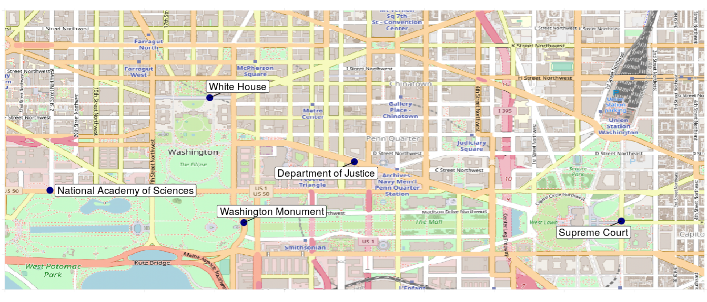

tidygeocoder demo
================

In honor of the recent Washington Nationals World Series win, we will
geocode some addresses in Washington, DC with the tidygeocoder package.

``` r
library(dplyr)
library(tidygeocoder)

# Make a tibble of addresses in DC
dc_addresses <- tribble( ~name,~addr,
       "White House", "1600 Pennsylvania Ave Washington, DC",
       "National Academy of Sciences", "2101 Constitution Ave NW, Washington, DC 20418",
       "Department of Justice", "950 Pennsylvania Ave NW, Washington, DC 20530",
       "Supreme Court", "1 1st St NE, Washington, DC 20543",
       "Washington Monument", "2 15th St NW, Washington, DC 20024"
                           )

# Geocode the addresses with the US Census geocoder
coordinates <- dc_addresses %>%
  geocode(addr)
```

``` r
library(knitr)
kable(coordinates)
```

| name                         | addr                                           |      lat |       long |
| :--------------------------- | :--------------------------------------------- | -------: | ---------: |
| White House                  | 1600 Pennsylvania Ave Washington, DC           | 38.89875 | \-77.03535 |
| National Academy of Sciences | 2101 Constitution Ave NW, Washington, DC 20418 | 38.89211 | \-77.04678 |
| Department of Justice        | 950 Pennsylvania Ave NW, Washington, DC 20530  | 38.89416 | \-77.02501 |
| Supreme Court                | 1 1st St NE, Washington, DC 20543              | 38.88990 | \-77.00591 |
| Washington Monument          | 2 15th St NW, Washington, DC 20024             | 38.88979 | \-77.03291 |

Pull OSM map data for DC. Use coordinates pulled from the
openstreemap.org GUI (click export button)

``` r
library(OpenStreetMap)

# Get DC Map
dc_map <- openmap( c(38.905,-77.05),c(38.885,-77.00))
dc_map.latlng <- openproj(dc_map)
```

Plot our points on our DC map

``` r
library(ggplot2)
library(ggrepel)
autoplot(dc_map.latlng) +
  theme_minimal() +
  theme(      axis.text.y=element_blank(),
              axis.title=element_blank(),
              axis.text.x=element_blank(),
              plot.margin = unit(c(0, 0, 0, 0), "cm")
              ) +
  geom_point(data=coordinates, aes(x=long, y=lat), color="navy", size=4, alpha=1) +
  geom_label_repel(data=coordinates,
        aes(label=name,x=long, y=lat),show.legend=F,box.padding=.5,size = 5)
```

<!-- -->
